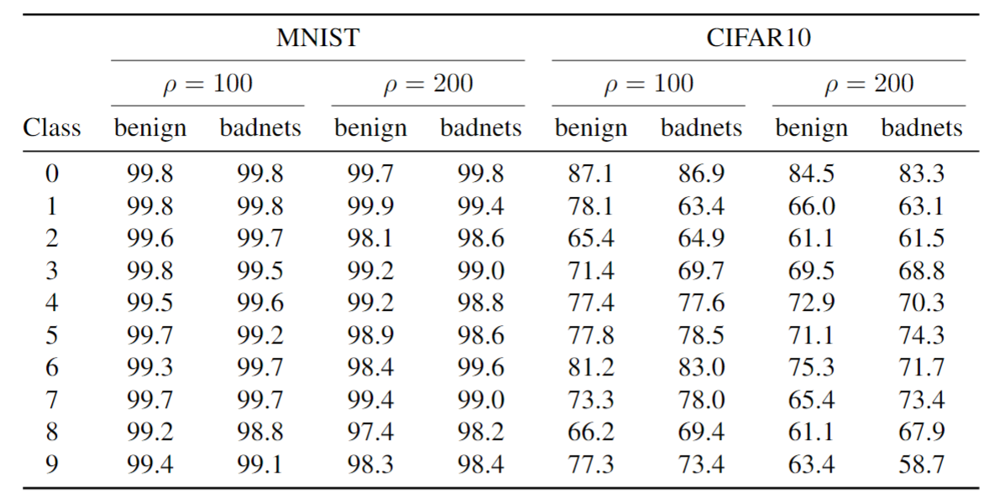
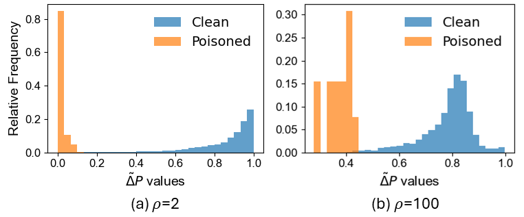

Table 1: The per-class AUC for clean and poisoned model on imbalanced MNIST and CIFAR10 datasets ($\mu = 0.9, \rho = 100, 200$) (Target class/majority class: 0, poisoned classes/minority classes: 1-9).

Figure 1: Relative frequency distribution of RPP for clean and poisoned samples on SVHN dataset with imbalance ratios: (a) $\mu$ = 0.9, $\rho$ = 2 and (b) $\mu$ = 0.9, $\rho$ = 100.
